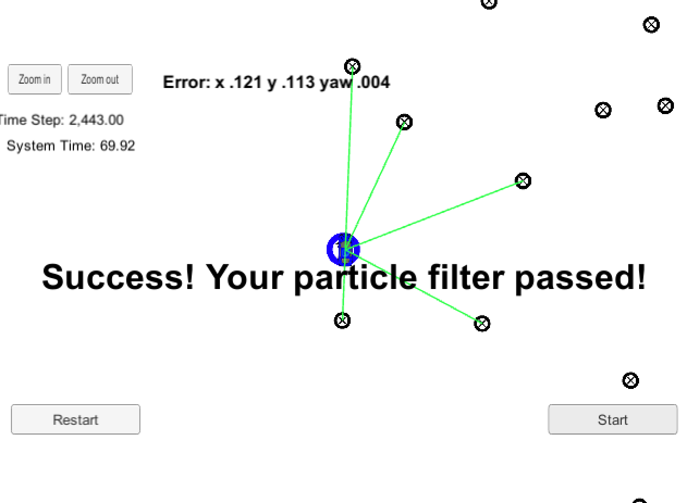
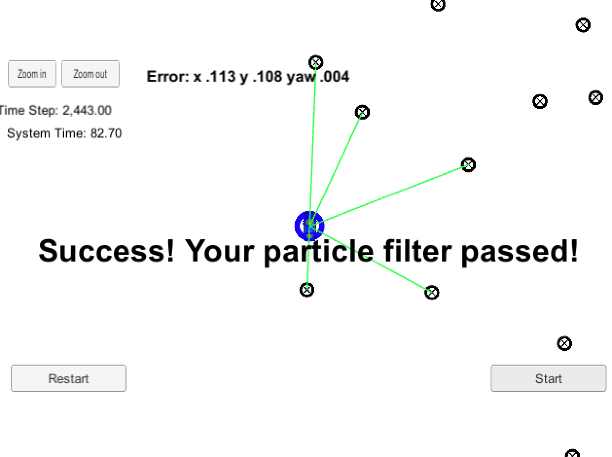
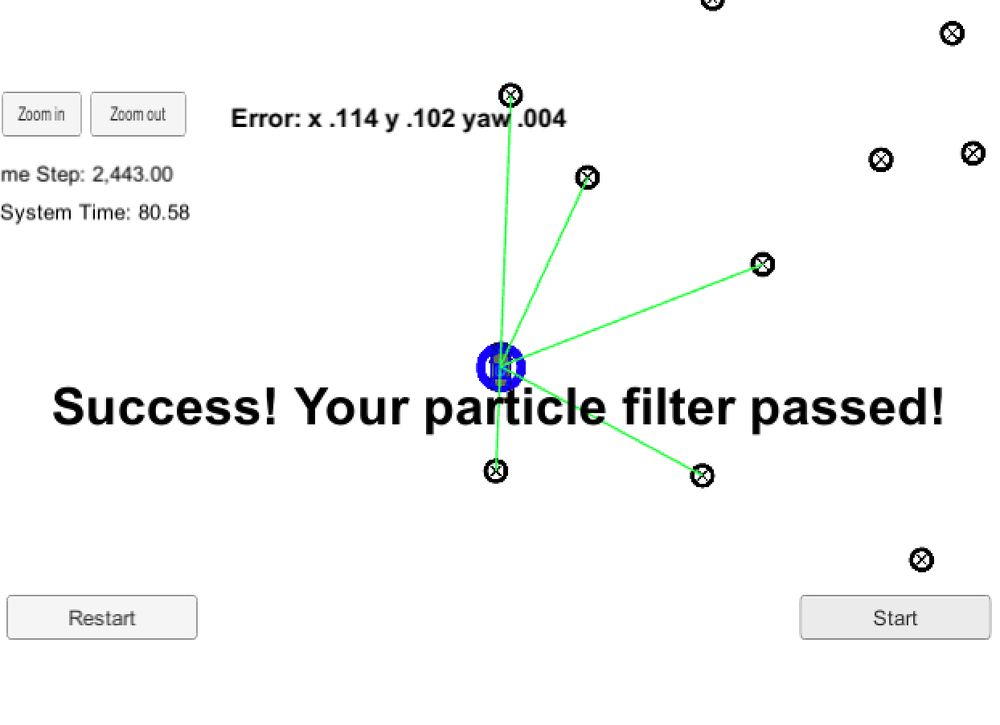
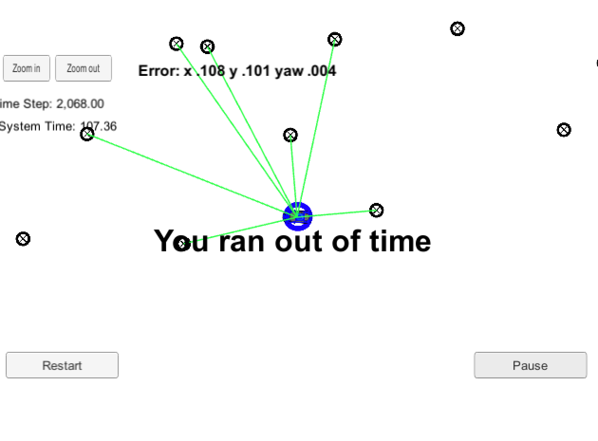

## Project Introduction
The robot has been kidnapped and transported to a new location! Luckily it has a map of this location, a (noisy) GPS estimate of its initial location, and lots of (noisy) sensor and control data.

In this project, I implemented a 2 dimensional particle filter in C++. With the information of a map and some initial localization information (analogous to what a GPS would provide), At each time step, the filter also gets observation and control data. 


## Running the Code
This project involves the Term 2 Simulator which can be downloaded [here](https://github.com/udacity/self-driving-car-sim/releases)

This repository includes two files that can be used to set up and intall uWebSocketIO for either Linux or Mac systems. For windows you can use either Docker, VMware, or even Windows 10 Bash on Ubuntu to install uWebSocketIO.

1. mkdir build
2. cd build
3. cmake ..
4. make
5. ./particle_filter


# Implementing the Particle Filter
The directory structure of this repository is as follows:

```
root
|   build.sh
|   clean.sh
|   CMakeLists.txt
|   README.md
|   run.sh
|
|___data
|   |   
|   |   map_data.txt
|   
|   
|___src
    |   helper_functions.h
    |   main.cpp
    |   map.h
    |   particle_filter.cpp
    |   particle_filter.h
```


## Implementating particle_filter.cpp
In this project, the particle_filter.cpp is the only part needed to be modified.

The particle filter mainly contains the following procedures:
1. Initialization: initialize all particles based on the first position info and all weights are assigned to 1
2. Prediction: add measurements to each particle and add random Gaussian noise.
3. updateWeights: Update the weights of each particle using a mult-variate Gaussian distribution. During this step, the main work is to find the data association between predicted landmarks for each particle and real landmark in the map. So it is required that those two part are in the same coordiante.
4. Resample: resample particles with replacement with probability proportional to their weight. 

### Tuning parameters
The accuracy and runtime would change with different number of particles used. I have tried 50, 100, 200 and 500(runtime too large).
When you have too many particles, it will significantly slow down the program since there are too much computation out there.


## Inputs to the Particle Filter
The inputs to the particle filter in the `data` directory. 

#### The Map
`map_data.txt` includes the position of landmarks (in meters) on an arbitrary Cartesian coordinate system. Each row has three columns
1. x position
2. y position
3. landmark id

### All other data the simulator provides, such as observations and controls.

> * Map data provided by 3D Mapping Solutions GmbH.

## Result
If your particle filter passes the current grading code in the simulator (you can make sure you have the current version at any time by doing a `git pull`), then you should pass! 

The things the grading code is looking for are:

1. **Accuracy**: your particle filter should localize vehicle position and yaw to within the values specified in the parameters `max_translation_error` and `max_yaw_error` in `src/main.cpp`.

2. **Performance**: your particle filter should complete execution within the time of 100 seconds.

When num_particles = 50, 100, 200, 500 respectively:

  num_particles = 50  |  num_particles = 100   
:--------------------:|:---------------------:
       |       


  num_particles = 200  |  num_particles = 500 
:---------------------:|:---------------------:
       |

